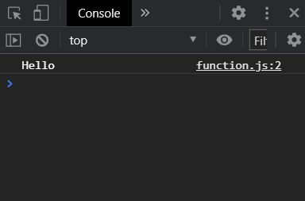
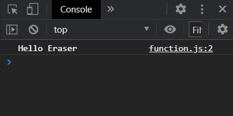
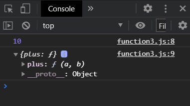

# Function


 `function` 키워드를 사용해서 함수를 선언한다. 인자로 받아올 값을 괄호 안에, 함수 내용을 중괄호 안에 작성한다.


## arguments


 간단한 함수를 만들어 보자. 인자를 받지 않는다.

```javascript
function sayHello(){
    console.log('Hello');
}

sayHello();
```



<br>

 인자를 받도록 바꿔 보자.

```javascript
function sayHello(potato){
    console.log('Hello', potato);
}

sayHello('Eraser');
```




<br>

 사용하지 않는 인자를 넣어도 된다.

```javascript
function sayHello(potato){
    console.log('Hello', potato);
}

sayHello('Eraser', 'Chicken'); // 콘솔: 'Hello Eraser'
```

<br>

 여러 개의 인자를 넣어 보자.

```javascript
function sayHello(potato, chicken){
    console.log('Hello', potato, 'you have', chicken, 'years of age.');
}

sayHello('Eraser', 26);
```


* 템플릿 문자열

 backtick 기호를 이용해서 변수만 구분할 수 있다.

```javascript
function sayBye(name, age) {
    console.log(`Hello ${name} you are ${age} years old.`);
}
```


## return


 return 값이 없으면, `undefined`가 나온다.

```javascript
function sayHello(name, age) {
    console.log `Hello ${name} you are ${age} years old`;
}

const greetEraser = sayHello(Eraser, 26);
console.log(greetEraser);

/* 콘솔 실행 결과
Hello Eraser you are 26 years old
undefined
*/
```

<br>

 함수가 실행되었을 때의 결과 값을 리턴 값으로 주자.

```javascript
function sayHello(name, age) {
    console.log('Hi');
    return `Hello ${name} you are ${age} years old`;
}

const greetEraser = sayHello(Eraser, 26);
console.log(greetEraser);

/* 콘솔 실행 결과
Hi
Hello Eraser you are 26 years old
*/
```


<br>

## 메소드


 object 안에 기능으로서 함수를 구현하면 메소드가 된다.  


```javascript
const calculator = {
    plus: function(a, b) {
        return a+b;
    }
}

const plus = calculator.plus(5, 5);
console.log(plus);
console.log(calculator)
```

