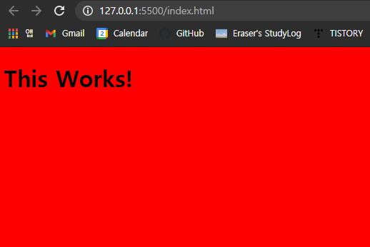
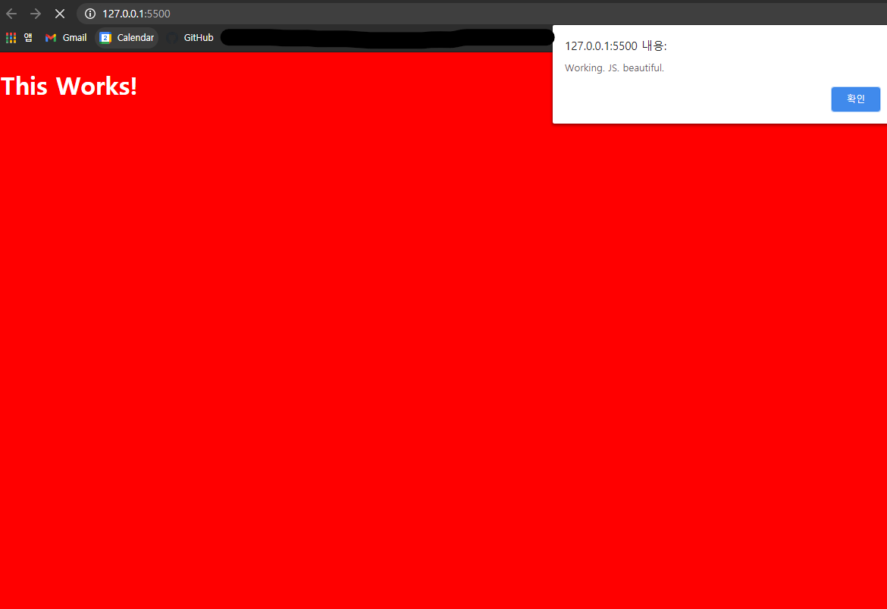

# 개발환경


 편한 에디터를 선택하자! Visual Studio Code, Repl, Atom, ...


# HTML CSS에 JavaScript 파일 추가


 간단한 html 파일을 만들고, css를 적용한 뒤, live server을 이용해 확인해 보자.

* `index.html`

```html
<!DOCTYPE html>
<html>
    <head>
        <title>Something</title>        
        <link rel='stylesheet' href='index.css' /> <!--CSS-->
    </head> 
    <body>
        <h1>This Works!</h1>
    </body>
</html>
```

* `index.css`

```css
body{
    background-color: red;
}
```





 이제 JS 파일을 적용해 보자. JS 파일은 항상 제일 **마지막**에 추가해야 한다. Body 아래에 있어야 한다.

* `index.html`
  * `<script>`를 닫는 방법에 주의한다.
  * `<script>` 아래에 JavaScript 코드를 작성해도 된다.

```html
<!DOCTYPE html>
<html>
    <head>
        <title>Something</title>        
        <link rel='stylesheet' href='index.css' />
    </head> 
    <body>
        <h1>This Works!</h1>
        <script src='index.js'></script> <!--JS 추가-->
    </body>
</html>
```


`<script>`에 작성했던 JS 파일을 만들고, JavaScript가 제대로 실행되는지 보기 위해 실행해 본다. 먼저 경고 메시지를 만든다. 

* `index.js`

```javascript
alert('Working. JS. beautiful.');
```




 잘 실행된다. JavaScript의 Hello World 언어를 배웠다!

<br>


 경고 메시지 말고, 디버깅을 위해 `console.log`를 실행할 수도 있다.

```javascript
console.log('Workng. JS. Beautiful')
```

> REPL에서는 console 창이 보이는데, VSCode에서는 어떻게 해야 하는지 모르겠다!

