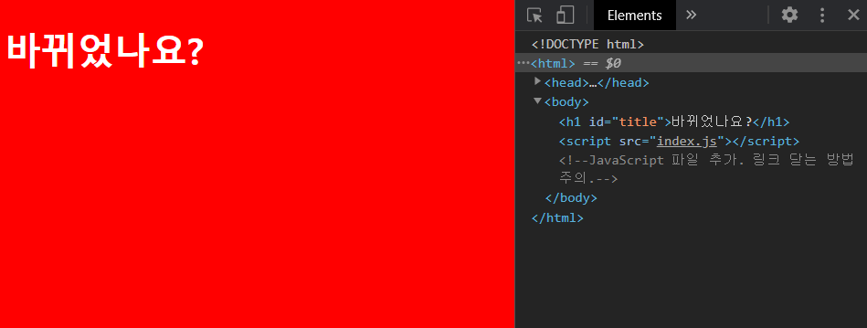
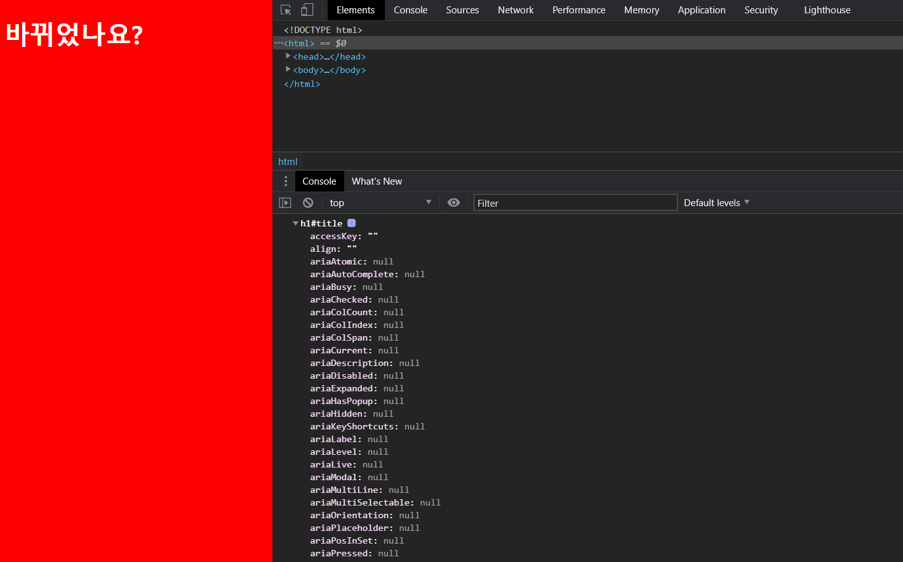

# DOM functions


 DOM(Document Object Model)은 JavaScript로 HTML 웹페이지를 제어하기 위한 객체 모델이다. `document` object를 사용하면 된다.

* JavaScript는 HTML 내에 존재하는 모든 요소를 object로 바꾼다.
* HTML 문서에 존재하는 모든 요소들이 DOM이다.


```javascript
console.log(document);

/* 실행 결과
HTMLDocument { location: 
[Getter/Setter]
...}
*/
```

<br>


## DOM


 HTML을 JavaScript의 DOM 객체로 변환하는 과정을 이해해 보자. `index.html` 페이지의 element를 선택하고, 바꿔 보자.


* `index.html`: `h1` 태그에 'title'이라는 id 속성을 준다.

```html
<!DOCTYPE html>
<html>
    <head>
        <title>Something</title>        
        <link rel='stylesheet' href='index.css' />  <!--CSS-->
    </head> 
    <body>
        <h1 id='title'>This Works!</h1>
        <script src='index.js'></script>
    </body>
</html>
```


* `index.js`

  * 태그 선택

    ```javascript
    const title = document.getElementById('title');
    console.log(title); // <h1 id="title">This Works!</h1>
    ```

  * 요소 바꾸기: `.innerHTML`

    ```javascript
    title.innerHTML = '바뀌었나요?';
    ```

 

<br>


 `dir` 메소드를 사용해서 변환된 DOM 객체가 가진 모든 속성을 확인해 보자.

```javascript
console.dir(title);
```



<br>

 배경색을 바꿀 수 있다.

```javascript
title.style.backgroundColor = 'peru';
```


<br>

## function examples


* `querySelector`: 노드의 첫 번째 자식 반환. CSS에서와 같이 id는 `#`으로, class는 `.`로 선택한다.

```javascript
const title = document.querySelector('#title')
```

