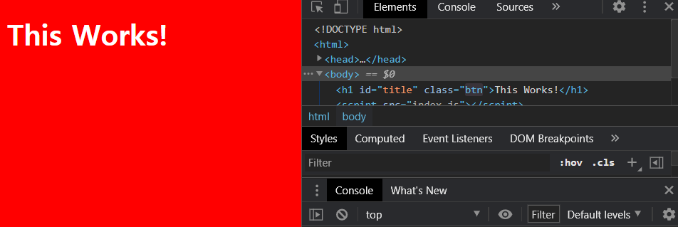

# Events


 JavaScript는 이벤트에 반응하기 위해 만들어진 언어이다. 웹사이트에서 발생하는 이벤트의 예는 다음과 같다. 모든 이벤트를 확인하고 싶다면, [MDN](https://developer.mozilla.org/ko/docs/Web/API/Document)을 확인하자.

* click
* resize
* submit
* input change load

 이벤트를 중간에 가로챌(?) 수 있다.

<br>

## 이벤트 리스너 

이벤트가 발생했을 때, 어떠한 처리를 할 것인지 담당하는 함수이다.


### addEventListener

 어떠한 object나 요소에 이벤트 리스너를 전달하는 메소드이다. 

* event: JavaScript가 기다리고 있는 이벤트(*listen to event*).
* listener: 지정된 이벤트가 특정 요소에서 발생했을 때, 실행할 함수. 호출할 함수의 **함수명**만을 전달한다.

<br>

 window 요소에 resize 이벤트가 발생했을 때, 특정한 함수를 실행하는 코드는 다음과 같다. 

```javascript
function handleResize() {
    console.log('I have been resized.');
}

window.addEventListener('resize', handleResize);
window.addEventListener('resize', handleResize()); // X
```

  html 파일을 열고 창의 크기를 바꾸면, 콘솔 창에 'I have been resized.'가 출력된다. 숫자는 이벤트가 발생한 횟수를 나타낸다.


 만약 함수를 호출하지 않고, 실행하는 방식(`handleResize()`)으로 전달하면, 이벤트가 발생하지 않았는데 그 시점에 바로 진행된다.

<br>

 이벤트가 무엇인지 알아 보자. 이벤트를 다룰 함수를 만들 때마다, JavasScript는 자동으로 함수를 이벤트에 붙인다. 따라서 이벤트를 다룰 수 있어야 한다. 

```javascript
function handleResize(event) {
    // console.log('I have been resized.');
    console.log(event);
}

window.addEventListener('resize', handleResize);
```


 resize 이벤트가 발생할 때마다, 콘솔 창에 다음과 같은 resize 이벤트 object가 출력된다.

 


> *참고* : resize
>
>  폼을 만들 때나 링크를 클릭할 때 유용한 이벤트이다.

<br>

 `title` 요소에 대해 클릭 시 동일한 `handleResize` 함수가 호출되도록 해 보자.

```javascript
const title = document.querySelector('#title')

function handleClick(event) {
    console.log('I have been clicked.');
    console.log(event);
}

console.log(title)
title.addEventListener('click', handleClick);
```


`title`인 'This Works!'를 클릭하면, 다음과 같이 파란색으로 변한다.  

<br>

 title을 클릭할 때마다 색을 바꿔 주는 이벤트 리스너를 만들고, 적용해 보자. 이벤트에 반응해서 컨텐츠를 바꿔 준다.

```javascript
const title = document.querySelector('#title');
const BASE_COLOR = 'rgb(52, 73, 94)';
const OTHER_COLOR = '#3498db'; //flatuicolor.com

function handleClick() {
    const currentColor = title.style.color;
    if (currentColor === BASE_COLOR){
        title.style.color = OTHER_COLOR;
    } else {
        title.style.color = BASE_COLOR;
    }
};

function init(){
    title.style.color = BASE_COLOR;
    title.addEventListener('click', handleClick)
};

init();
```

<br>

 온라인, 오프라인이 될 때 동작하도록 바꿀 수도 있다.

```javascript
function handleOffline() {
    console.log('OMG... bye!');
}

function handleOnline() {
    console.log('welcome back!');
}

window.addEventListener('offline', handleOffline);
window.addEventListener('online', handleOnline);
```


## 구현


 HTML은 HTML에서만, CSS는 CSS에서만 하도록 구현한다. 위에서는 JavaScript가 직접 웹사이트의 스타일을 처리했지만, 사실 좋은 방법이 아니다.

<br>

### className


  이제 CSS에서 클래스를 만들고, JavaScript에서 HTML element를 제어해서 CSS 클래스로 바꿔 보자. 

* `index.css`

```css
body{
    background-color: red;
}

h1 {
    color: white;
}

.clicked {
    color: #7f8c8d;
}
```


* `index.js`

 클릭할 때마다 h1 클래스의 이름이 바뀐다.

```javascript
const title = document.querySelector('#title');
const CLICKED_CLASS = 'clicked';

function handleClick() {
    const currentClass = title.className;
    if (currentClass !== CLICKED_CLASS) {
        title.className = CLICKED_CLASS;
    } else {
        title.className = '';
    }
}

function init() {
    title.addEventListener('click', handleClick);
}

init();
```


<br>

 위와 같이 코드를 작성했을 때, 문제가 되는 상황은 다음(replacing)과 같다. 만약 `h1` 클래스에 이전에 pointer cursor가 있었다면, 클릭했을 때 포인터가 사라지고, 보이지 않게 된다. 이전 클래스가 존중되지 않는 것이다.


* `index.css`

```css
body{
    background-color: red;
}

h1 {
    color: white;
}

.clicked {
    color: #7f8c8d;
}

.btn {
    cursor: pointer;
}
```


* `index.html`

```html
<!DOCTYPE html>
<html>
    <head>
        <title>Something</title>        
        <link rel='stylesheet' href='index.css' />  <!--CSS-->
    </head> 
    <body>
        <h1 id='title' class='btn'>This Works!</h1>
        <script src='index.js'></script>
    </body>
</html>
```

|                             원래                             |                          클릭 후 1                           |                          클릭 후 2                           |
| :----------------------------------------------------------: | :----------------------------------------------------------: | :----------------------------------------------------------: |
|  |  |  |


### [classList](https://developer.mozilla.org/en-US/docs/Web/API/Element/classList)


 classList는 `add`, `remove` 등의 메소드를 갖는다. `handleClick` 함수를 다음과 같이 수정해 보자.

<br>

```javascript
function handleClick() {
    const currentClass = title.className;
    if (currentClass !== CLICKED_CLASS) {
        title.classList.add(CLICKED_CLASS);
    } else {
        title.classList.remove(CLICKED_CLASS);
    }
}
```

 더 이상 `btn` 클래스가 사라지지 않는다.


<br>

 그러나 다시 클릭했을 때 뒤로 돌아가지 않는다. `currentClass`가 더 이상 'clicked'가 아니라, 'btn class'이기 때문이다. `contains` 메소드를 사용해 보자.

```javascript
function handleClick() {
    const hasClass = title.classList.contains(CLICKED_CLASS); //boolean
    if (!hasClass) {
        title.classList.add(CLICKED_CLASS);
    } else {
        title.classList.remove(CLICKED_CLASS);
    }
}
```


|                          클릭 후 1                           |                          클릭 후 2                           |
| :----------------------------------------------------------: | :----------------------------------------------------------: |
|  |  |


> *참고* 
>
>  위의 코드를 조금 더 직관적으로 바꾸려면 다음과 같이 작성하면 된다.
>
> ```javascript
> function handleClick() {
>     const hasClass = title.classList.contains(CLICKED_CLASS); //boolean
>     if (hasClass) {
>         title.classList.remove(CLICKED_CLASS);
>     } else {
>         title.classList.add(CLICKED_CLASS);
>     }
> }
> ```


<br>

 그래도 너무 길다! `toggle` 함수를 사용하자.

```javascript
function handleClick() {
    title.classList.toggle(CLICKED_CLASS);
}
```

