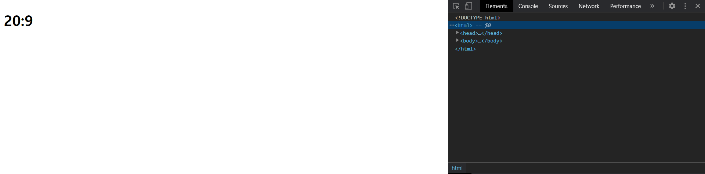
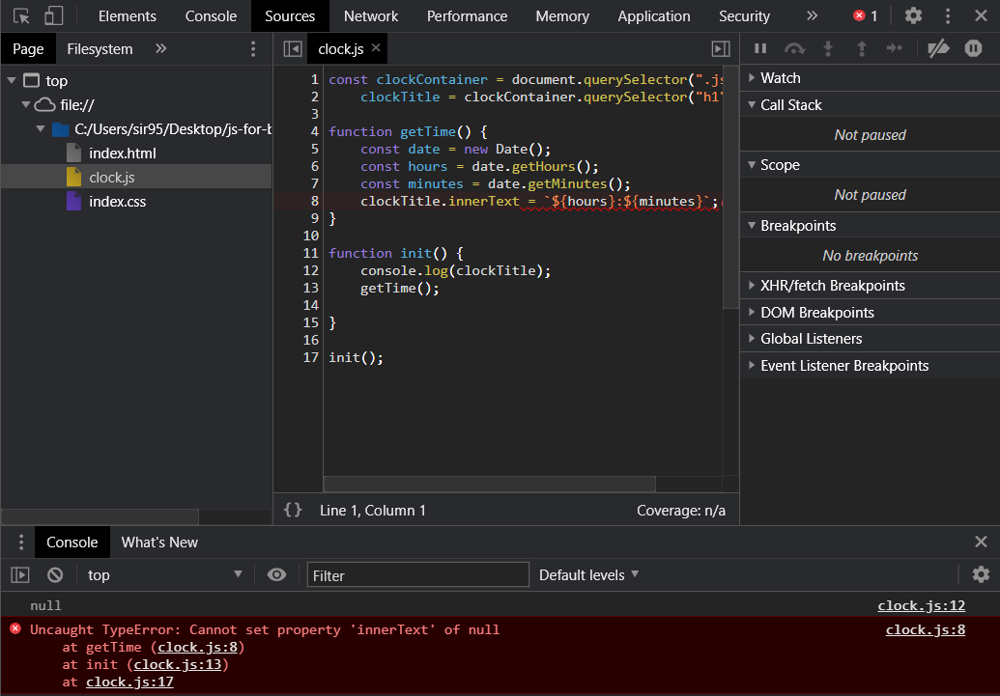

<sup>이제부터 `index.html`, `index.css` 파일은 `#3` 폴더에 있는 파일을 지칭.</sup>

<br>

# Clock


  Momentum 앱에 들어갈 시계를 만든다. 


## 시간 관련 객체

 Date 객체를 사용해서 시간을 알아볼 수 있다. 시스템 시계의 설정 시간에 따라서 다른 값을 반환할 수 있다.

```javascript
const date = new Date(); // 현재 날짜와 시간을 갖는 인스턴스 반환
date; // Sat Nov 07 2020 19:48:35 GMT+0900 (대한민국 표준시)
date.getDay(); // 요일: 0(일요일) ~ 6(토요일).
date.getDate(); // 7
date.getHours(); // 19
```


## index.html

1. `div` 클래스, `h1` 클래스를 만든다.
   * `div`: 시계 그 자체.
   * `h1`: 시간 정보 들어갈 곳.

```html
<!DOCTYPE html>
<html>
    
<head>
    <title>Something</title>
    <link rel='stylesheet' href='index.css' />
</head>

<body>
    <div class='js-clock'>
        <h1 class='js-title'></h1> <!-- 오류1 났던 부분. -->
    </div>
    <script src='clock.js'></script>
</body>

</html>
```


## clock.js

0. `init()` 함수 만들어 놓고, 틀을 잡고 시작한다.

```javasc
function init() {

}

init();
```


1. 변수부터 html 문서에서 가져 올 요소부터 변수로 정의해 둔다.
   * `clockContainer`: document에서 clock 요소를 가져 온다.
   * `clockTitle`: `class`의 자식(`h1`)을 가져 온다.

```python
const clockContainer = document.querySelector(".js-clock"),
    clockTitle = clockContainer.querySelector("h1");

function init() {

}

init();
```


2. 현재 시각을 알아 와서, 시간 정보를 넣어주는 함수를 만든다. 
   * Date 오브젝트.
   * `.innerText` : 오브젝트 안에 문자열을 넣어 준다.

```javascript
const clockContainer = document.querySelector(".js-clock"),
    clockTitle = clockContainer.querySelector("h1");

function getTime() {
    const date = new Date();
    const hours = date.getHours();
    const minutes = date.getMinutes();
    clockTitle.innerText = `${hours}:${minutes}`;
}

function init() {
    getTime();
}

init();
```



> *오류 1*
>
>  
>
> - `date` 까지는 된다.
> - `h1` 태그가 null이다. html 파일에서 `<div>` 태그 닫고 `<h1>`을 만들었다;;


3. `setInterval` 함수를 사용해  시간 정보가 업데이트되도록 한다. 이 함수는 다음의 argument를 받는다.
   * `fn`: 실행할 함수.
   * 실행할 시간 간격. *milisecond* 기준이다.

```javascript
const clockContainer = document.querySelector(".js-clock"),
    clockTitle = clockContainer.querySelector("h1");

function getTime() {
    const date = new Date();
    const hours = date.getHours();
    const minutes = date.getMinutes();
    const seconds = date.getSeconds();
    clockTitle.innerText = `${hours}:${minutes}:${seconds}`;
}

function init() {
    getTime();
    setInterval(getTime, 1000);
}

init();
```


4. `ternary operator`를 적용해 보여지는 시간의 형식을 바꿔 준다.

```javascript
const clockContainer = document.querySelector(".js-clock"),
    clockTitle = clockContainer.querySelector("h1");

function getTime() {
    const date = new Date();
    const hours = date.getHours();
    const minutes = date.getMinutes();
    const seconds = date.getSeconds();
    clockTitle.innerText = `${hours < 10 ? `0${hours}` : hours}:${
        minutes < 10 ? `0${minutes}` : minutes}:${
        seconds < 10 ? `0${seconds}` : seconds}`;
}

function init() {
    getTime();
    setInterval(getTime, 1000);
}

init();
```

