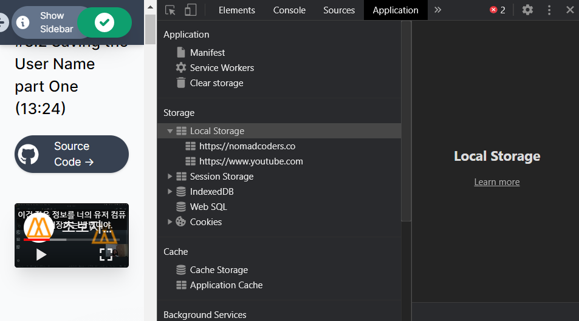
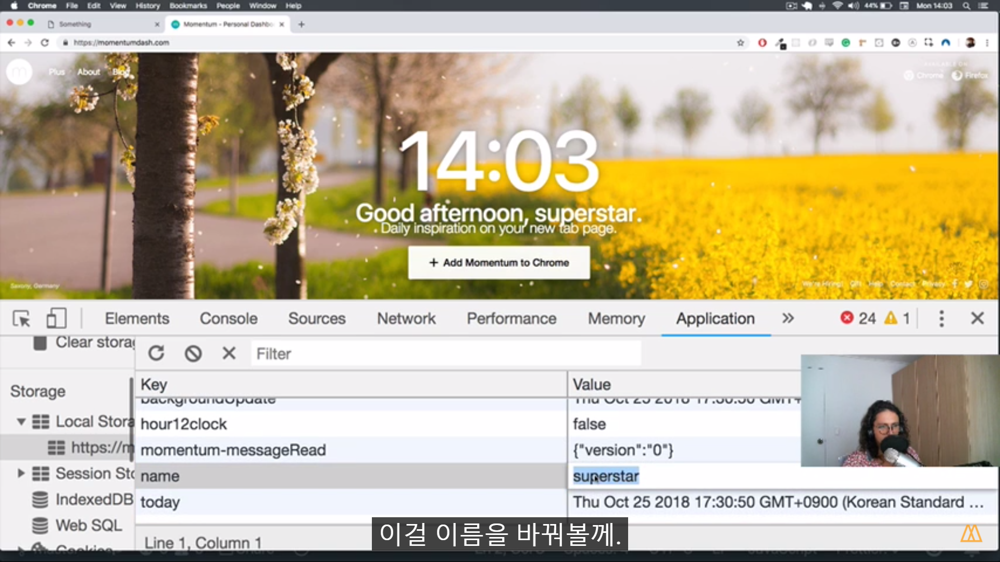
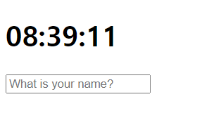
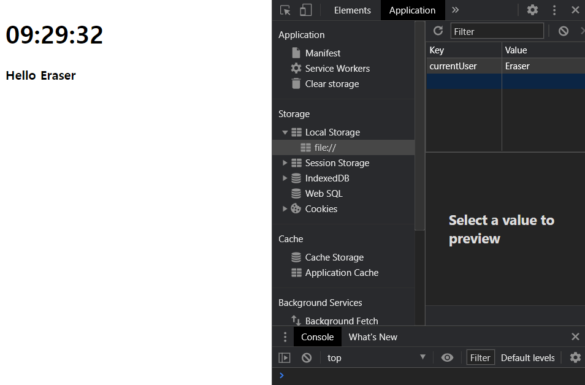
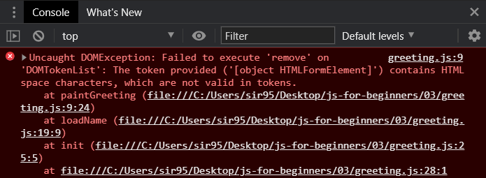
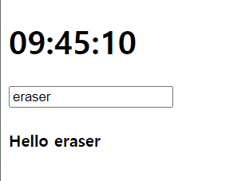
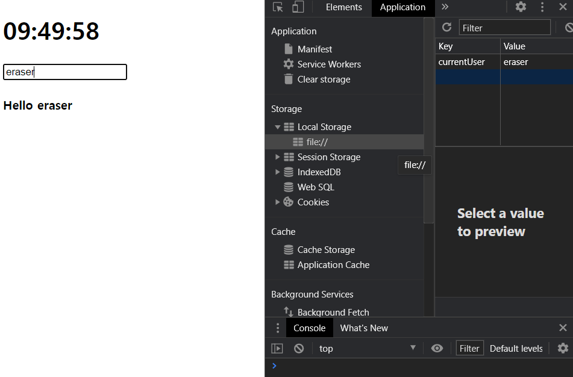

# User Name


 사용자의 이름을 받아 저장한다.

<br>

## local storage


 정보를 유저의 컴퓨터(브라우저)에 저장한다.  JavaScript 정보들을 저장하는 스토리지이다. `검사` - `Application` - `Storage` - `Local Storage`를 확인해 보자.



<br>

 momentum 앱 페이지를 검사해 보면, 다음과 같은 정보들이 저장되어 있음을 알 수 있다. 저장된 정보를 변경하면, 화면 내에서 보여지는 내용도 변경된다.

<br>

```javascript
localStorage.setItem('Eraser', true); // local storage에 Eraser true 속성이 생성된다.
localStorage.getItem('Eraser'); // true.
localStorage.getItem('username'); // null.
```

<br>

 로컬 스토리지는 url을 기반으로 동작한다. 즉, facebook이 거기에 넣어서 가지고 있는 로컬 스토리지를 가져올 수는 없다는 것이다.

<br>

## preventDefault

 원래 이벤트는 root에서 발생한다. 아래서 다룰 form의 submit 이벤트를 예로 들면, form에서 발생한 submit 이벤트가 document 레벨까지 위로 올라가, 다른 모든 것들이 submit 이벤트에 영향을 받는 것이다. 실제로 해당 이벤트를 발생시켜 보면, 페이지가 새로고침되는 것을 알 수 있다. 유저가 form에 이름 정보를 적어 submit 하면, document가 새로고침되도록 default 동작이 프로그래밍되어 있다는 의미이다. 이를 방지하도록 하는 것이 **prevent default 옵션**이다.

<br> 


## index.html


1. form을 만든다.

```html
<!DOCTYPE html>
<html>
    
<head>
    <title>Something</title>
    <link rel='stylesheet' href='index.css' />
</head>

<body>
    <div class='js-clock'>
        <h1 class='js-title'></h1>
    </div>
    <form class='js-form form'>
        <input type='text' placeholder='What is your name?' />
    </form>
    <script src='clock.js'></script>
</body>

</html>
```


 아래와 같이 간단한 양식이 나타나면 된다.



<br>

2. `greeting.js`를 스크립트 소스로 연결한다. 

```html
<!DOCTYPE html>
<html>
    
<head>
    <title>Something</title>
    <link rel='stylesheet' href='index.css' />
</head>

<body>
    <div class='js-clock'>
        <h1 class='js-title'></h1>
    </div>
    <form class='js-form form'>
        <input type='text' placeholder='What is your name?' />
    </form>
    <script src='clock.js'></script>
    <script src='greeting.js'></script>
</body>

</html>
```

<br>


## index.css


1. 몇 가지 css 클래스를 만든다.
   * form과 greetings의 경우, `display: None` 속성을 준다.
   * showing의 경우, `block` 형태로 보여주도록 `display: block`을 설정한다.

```css
.form,
.greetings{
    display: none;
}

.showing{
    display: block;
}
```


<br>

## greeting.js


0. 시계를 만들 때와 했던 것과 마찬가지로 `init()` 함수를 만들어 놓고, 사용할 영역을 변수로 설정해 둔다.

```javascript
const form = document.querySelector(".js-form"),
    input = form.querySelector("input"),
    greeting = document.querySelector(".js-greetings");

function init() {

}

init();
```

<br>

1. 로컬 스토리지에서 user 정보를 받아 오고, 조건을 체크하여 무언가 하도록 하는 틀을 만들어 두자.

   * 로컬 스토리지에 유저가 있는지 없는지에 따라 CSS 적용할 속성이 달라진다.
     * `USER_LS`: 로컬 스토리지에서 유저가 있는지 확인할 변수.
     * `SHOWING_CN`: 보여줄지 말지 결정하는 클래스 이름. CSS에서 정의한 class 이름과 동일하게 가져가야 한다.

   * 각 경우에 따른 동작
     * 로컬 스토리지에 유저가 있을 때에는 이름 입력 받는 란을 칠한다. → `paintGreetings` 함수.
     * 로컬 스토리지에 유저가 없을 때에는  → `askForName` 함수.

```javascript
const form = document.querySelector(".js-form"),
    input = form.querySelector("input");

const USER_LS = 'currentUser',
    SHOWIG_CN = 'showing';

function loadName() {
    const currrentUser = localStorage.getItem(USER_LS);
    if (currentUser === null) {
        // user is not
    } else {
        //user is
    }

}

function init() {
    loadName();
}

init();
```

<br>

2. 유저 정보가 있을 때 동작할 함수(`paintGreeting`)를 만든다.
   * 정보가 이미 로컬 스토리지에 있으면, 입력받는 form이 필요 없으므로 숨긴다.
   * greeting  영역을 box로 보여줄 수 있도록 `showing`을 클래스 네임에 추가해 준다. 그리고` innerText`를 설정한다.

```javascript
const form = document.querySelector(".js-form"),
    input = form.querySelector("input"),
    greeting = document.querySelector(".js-greetings");

const USER_LS = 'currentUser',
    SHOWING_CN = 'showing';

function paintGreeting(text) {
    greeting.classList.remove(SHOWING_CN); // user가 있으면 form 숨김.
    greeting.classList.add(SHOWING_CN); // user가 있으면 showing.
    greeting.innerText = `Hello ${text}`; // 보여준 뒤 인사!
}

function loadName() {
    const currrentUser = localStorage.getItem(USER_LS);
    if (currentUser === null) {
        // user is not
    } else {
        paintGreeting(currentUser); // user 정보 존재.
    }

}

function init() {
    loadName();
}

init();
```

 확인을 위해 실행해도, 지금 단계에서는 아무 일도 일어나지 않는다. 현재 유저 정보가 없지만, 그 부분을 설계하지 않았기 때문이다. 단순히 테스트를 위한 목적으로, Application 탭에서 수동으로 currentUser 키를 생성해 보자.



<br>


> *오류 1* : `remove`에서 form이라고 오타.
>
> 

<br>

3. 유저 정보가 없을 경우 어떻게 동작할 지 설정하는 함수(`askForName`)를 만든다.
   - currentUser가 없을 때 유저에게 이름을 요청한다.
   - 유저가 없을 경우 form을 보여주기 위해, class name에 showing을 추가한다.
   - 유저가 폼에 입력한 후 submit하면, 처리하는 이벤트 리스너를 만든다.

```javascript
const form = document.querySelector(".js-form"),
    input = form.querySelector("input"),
    greeting = document.querySelector(".js-greetings");

const USER_LS = 'currentUser',
    SHOWING_CN = 'showing';

function handleSubmit(event) {

}

function askForName() {
    form.classList.add(SHOWING_CN); // form을 보여 준다.
    form.addEventListener('submit', handleSubmit); // form 제출 시 이벤트를 처리하도록 한다.
}

function paintGreeting(text) {
    greeting.classList.remove(SHOWING_CN); // user가 있으면 form 숨김.
    greeting.classList.add(SHOWING_CN); // user가 있으면 showing.
    greeting.innerText = `Hello ${text}`; // 보여준 뒤 인사!
}

function loadName() {
    const currentUser = localStorage.getItem(USER_LS);
    if (currentUser === null) {
        askForName();
    } else {
        paintGreeting(currentUser); // user 정보 존재.
    }

}

function init() {
    loadName();
}

init();
```

<br>

4. submit 이벤트를 처리할 이벤트 핸들러 함수를 설계한다.

```javascript
const form = document.querySelector(".js-form"),
    input = form.querySelector("input"),
    greeting = document.querySelector(".js-greetings");

const USER_LS = 'currentUser',
    SHOWING_CN = 'showing';

function handleSubmit(event) {
    event.preventDefault(); // submit 기본 동작을 막는다.
    const currentValue = input.value; // input 파라미터의 현재 값을 받아 온다.
    paintGreeting(currentValue); // 받아 온 유저의 현재 이름을 paintGreeting 함수에 넘긴다.
}

function askForName() {
    form.classList.add(SHOWING_CN); // form을 보여 준다.
    form.addEventListener('submit', handleSubmit); // form 제출 시 이벤트를 처리하도록 한다.
}

function paintGreeting(text) {
    greeting.classList.remove(SHOWING_CN); // user가 있으면 form 숨김.
    greeting.classList.add(SHOWING_CN); // user가 있으면 showing.
    greeting.innerText = `Hello ${text}`; // 보여준 뒤 인사!
}

function loadName() {
    const currentUser = localStorage.getItem(USER_LS);
    if (currentUser === null) {
        askForName();
    } else {
        paintGreeting(currentUser); // user 정보 존재.
    }

}

function init() {
    loadName();
}

init();
```

 다음과 같이 유저가 이름을 적어 제출하면, 이름이 뜨고 인사 문구가 나온다. 



 그러나 여전히 문제가 있다. 이렇게 제출한 이름 정보가 저장되지 않는다. 유저 컴퓨터(브라우저)가 이것을 기억하지 못한다는 의미이다.

<br>

5. 로컬 스토리지에 이름을 저장하는 함수를 만든다.

```javascript
const form = document.querySelector(".js-form"),
    input = form.querySelector("input"),
    greeting = document.querySelector(".js-greetings");

const USER_LS = 'currentUser',
    SHOWING_CN = 'showing';

function saveName(text) {
    localStorage.setItem(USER_LS, text); // 로컬 스토리지에 이름을 저장한다.
}

function handleSubmit(event) {
    event.preventDefault(); // submit 기본 동작을 막는다.
    const currentValue = input.value; // input 파라미터의 현재 값을 받아 온다.
    saveName(currentValue); // 받아 온 유저의 이름을 저장한다.
    paintGreeting(currentValue); // 받아 온 유저의 현재 이름을 paintGreeting 함수에 넘긴다.
}

function askForName() {
    form.classList.add(SHOWING_CN); // form을 보여 준다.
    form.addEventListener('submit', handleSubmit); // form 제출 시 이벤트를 처리하도록 한다.
}

function paintGreeting(text) {
    greeting.classList.remove(SHOWING_CN); // user가 있으면 form 숨김.
    greeting.classList.add(SHOWING_CN); // user가 있으면 showing.
    greeting.innerText = `Hello ${text}`; // 보여준 뒤 인사!
}

function loadName() {
    const currentUser = localStorage.getItem(USER_LS);
    if (currentUser === null) {
        askForName();
    } else {
        paintGreeting(currentUser); // user 정보 존재.
    }

}

function init() {
    loadName();
}

init();
```

 이제 로컬 스토리지에 저장되는 것을 볼 수 있다.



<br>

 페이지를 새로고침한 후 계속 실행해도 이름이 그대로 남아 있고, form은 사라진다. 만약 다시 물어봐서 저장하고 싶다면, local storage에서 currentUser 속성을 삭제하면 된다.