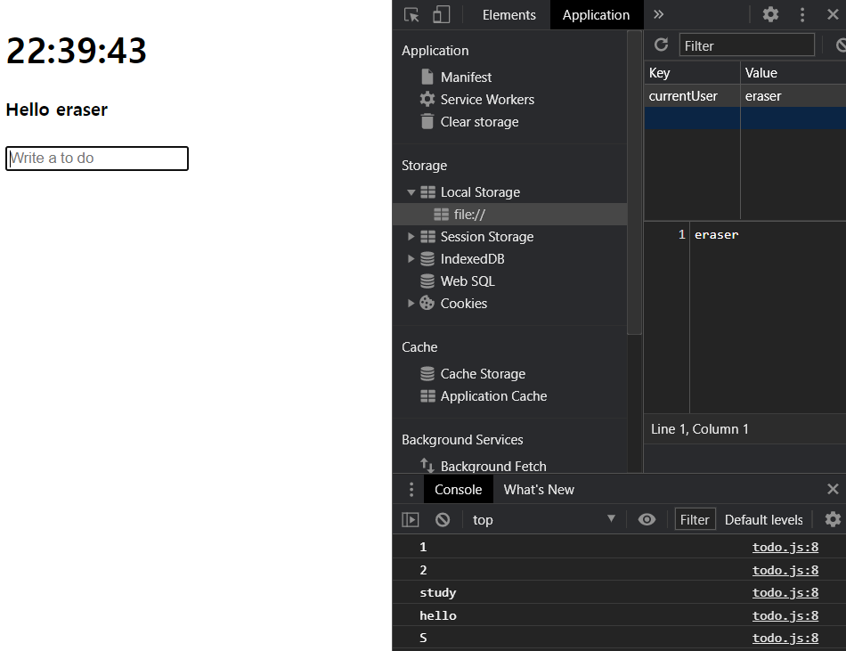
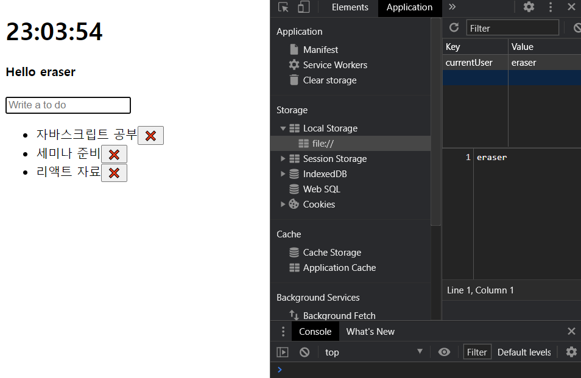
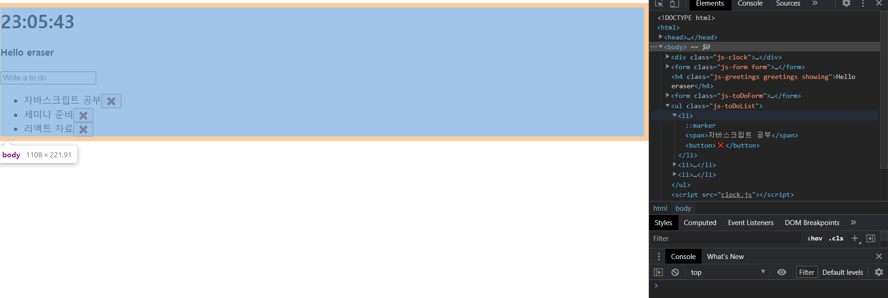

# ToDo 리스트


 To Do 리스트를 만든다.  greetings와 비슷하다. 그러나 hiding과 showing이 없다. 

<br>

## createElement

 이전까지의 query selector는 HTML document에서 필요한 것을 얻어 오는 형태였다. 그러나 이와 반대로, 생성하기를 원한다면, `.createElement` 메소드를 사용한다.

<br>

## index.html


1. todo form과 리스트를 만든 후, todo 스크립트를 연결한다.

```html
<!DOCTYPE html>
<html>
    
<head>
    <title>Something</title>
    <link rel='stylesheet' href='index.css' />
</head>

<body>
    <div class='js-clock'>
        <h1 class='js-title'></h1>
    </div>
    <form class='js-form form'>
        <input type='text' placeholder='What is your name?' />
    </form>
    <h4 class='js-greetings greetings'></h4>
    <form class='js-toDoForm'> <!-- todo form -->
        <input type='text' placeholder='Write a to do' />
    </form>
    <ul class='js-toDoList'></ul> <!-- todo 리스트 -->
    <script src='clock.js'></script>
    <script src='greeting.js'></script>
    <script src='todo.js'></script>
</body>

</html>
```

<br>

2. emoji가 안 보일 수 있으므로, `charset`을 'utf-8'로 설정해 준다.

```html
<!DOCTYPE html>
<html>
    
<head>
    <title>Something</title>
    <meta charset='utf-8' />
    <link rel='stylesheet' href='index.css' />
</head>

<body>
    <div class='js-clock'>
        <h1 class='js-title'></h1>
    </div>
    <form class='js-form form'>
        <input type='text' placeholder='What is your name?' />
    </form>
    <h4 class='js-greetings greetings'></h4>
    <form class='js-toDoForm'>
        <input type='text' placeholder='Write a to do' />
    </form>
    <ul class='js-toDoList'></ul>
    <script src='clock.js'></script>
    <script src='greeting.js'></script>
    <script src='todo.js'></script>
</body>

</html>
```


<br>

## todo.js

0. 그 전까지와 마찬가지로,  HTML document에서 불러와 사용할 변수들을 선언해 둔다. 
   * `form`, `input` 등의 변수 이름을 사용할 경우, `greetings.js` 등 다른 파일에서와 충돌할 우려가 있다. 좋지 않다.
   * 새로운 변수 명을 사용한다.

```javascript
const toDoForm = document.querySelector('.js-toDoForm'),
    toDoInput = toDoForm.querySelector('input'),
    toDoList = document.querySelector('.js-toDoList');

function init() {

}

init();
```

<br>


1. `toDo` 리스트를 보여 주는 `loadToDos` 함수를 설계한다.
   * 로컬 스토리지에서 load해올 것이므로 로컬 스토리지 `toDo` 속성을 이용해 아이템을 가져 오도록 변수를 설정한다. 
   * `loadToDos` 함수: 로드해올 것이 있을 때와 없을 때로 나누어 설계한다.
     * `toDos`가 있을 때: `toDoForm`은 항상 보여지는 것이므로, 일단은 크게 작업을 설계하지 않는다.
     * `toDos`가 없을 때:  무언가 작업을 한다.

```javascript
const toDoForm = document.querySelector('.js-toDoForm'),
    toDoInput = toDoForm.querySelector('input'),
    toDoList = document.querySelector('.js-toDoList');

const TODOS_LS = 'toDos'; // 로컬 스토리지의 toDo 속성 키.

function loadToDos() {
    const toDos = localStorage.getItem(TODOS_LS); // 로컬 스토리지에서 toDo 속성값을 가져 온다.
    if (toDos === null) {
        // toDo가 없는 경우.
    } else {
        // toDo가 있는 경우.
    }
}

function init() {
    loadToDos(); 
}

init();
```

<br>

2. `toDoForm`에 submit 이벤트가 발생했을 때 이벤트를 핸들링하는 과정을 설계한다.
   * default 동작을 해제한다.
   * submit 이벤트 발생했을 때의 현재 값을 가져 온다.
   * `paintToDo` 함수를 호출한다.
   * 이후 input form에 입력되어 있는 글자를 초기화한다.

```javascript
const toDoForm = document.querySelector('.js-toDoForm'),
    toDoInput = toDoForm.querySelector('input'),
    toDoList = document.querySelector('.js-toDoList');

const TODOS_LS = 'toDos';


function paintToDo(text) {
    // submit 이벤트 발생 시 호출될 함수.
    console.log(text); // 확인용.
}

function handleSubmit(event) {
    event.preventDefault(); // default 동작 설정 해제.
    const currentValue = toDoInput.value; // toDoForm 제출되었을 때의 값.
    paitnToDo(currentValue); // 현재 값을 paintToDo에 전달.
    toDoInput.value = ''; // submit 후 form의 input 삭제.
}

function loadToDos() {
    const toDos = localStorage.getItem(TODOS_LS);
    if (toDos !== null) {
    } 
}

function init() {
    loadToDos(); 
    toDoForm.addEventListener('submit', handleSubmit) // toDoForm의 submit 이벤트 핸들링.
}

init();
```

  이 단계까지 진행한 후, toDo가 제대로 저장되는지 확인하기 위해 form에 입력하고, submit한 후, console에 찍어 보자.



<br>

3. `paintToDo` 함수를 설계한다.

   * `toDo`로 보여 줄 리스트를 만든다.

     > 예컨대, 다음과 같은 형태로 설계되어야 한다.
     >
     > ```html
     >     <ul class='js-toDoList'>
     >         <li id='1'>blablabla</li> <!-- 예시 -->
     >     </ul>
     > ```
     >
     > * `li` 태그 이용.
     > * 숫자 타입의 id를 갖고, text를 갖도록 만들어야 한다.

     * 필요한 태그들을 생성한다.
       * `li`: toDo 리스트로 들어갈 리스트 태그.
       * `delBtn`: 삭제 버튼. (이모지: `window` + `.`)
       * `span`: text container로 사용할 태그. 버튼이 옆에 들어간다.
     * `li` 태그 아래에 `span`과 `delBtn`을 자식 요소로 추가한다. 즉, `li` 태그가 `span`과 `delBtn`의 컨테이너가 된다.
     * `toDoList`에 생성한 toDo 리스트들의 태그(`li`)를 자식 요소로 추가한다.


```javascript
const toDoForm = document.querySelector('.js-toDoForm'),
    toDoInput = toDoForm.querySelector('input'),
    toDoList = document.querySelector('.js-toDoList');

const TODOS_LS = 'toDos';

function paintToDo(text) {
    const li = document.createElement('li'); // li 생성.
    const delBtn = document.createElement('button'); // 삭제를 위한 delete button 생성.
    delBtn.innerText = '❌'; // 삭제 버튼에 이모지 삽입.
    const span = document.createElement('span'); // span 태그 생성.
    span.innerText = text; // submit 시 생성되어서 올 currentValue.
    li.appendChild(span); // li 아래에 span을 자식 요소로 넣는다.
    li.appendChild(delBtn); // li 아래에 delBtn을 자식 요소로 넣는다.
    toDoList.appendChild(li); // toDoList에 li를 자식 요소로 추가한다.
}

function handleSubmit(event) {
    event.preventDefault();
    const currentValue = toDoInput.value;
    paintToDo(currentValue); 
    toDoInput.value = ''; 
}

function loadToDos() {
    const toDos = localStorage.getItem(TODOS_LS);
    if (toDos !== null) {
    } 
}

function init() {
    loadToDos(); 
    toDoForm.addEventListener('submit', handleSubmit) 
}

init();
```

 잘 동작하는지 확인해 보자. 



<br>

 HTML 태그를 확인해 보면, 태그가 생성되어 있다!




