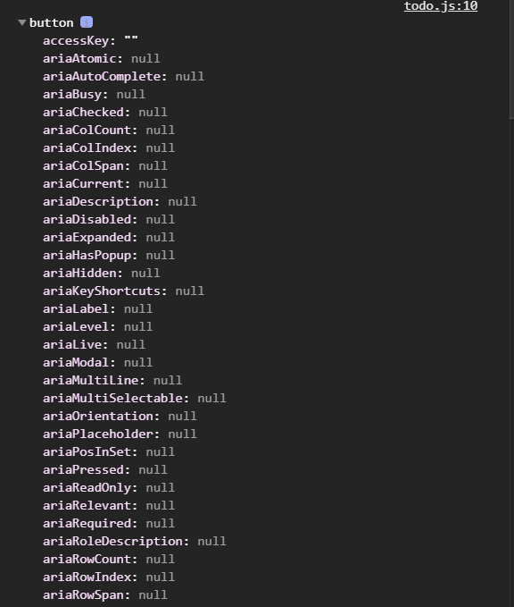
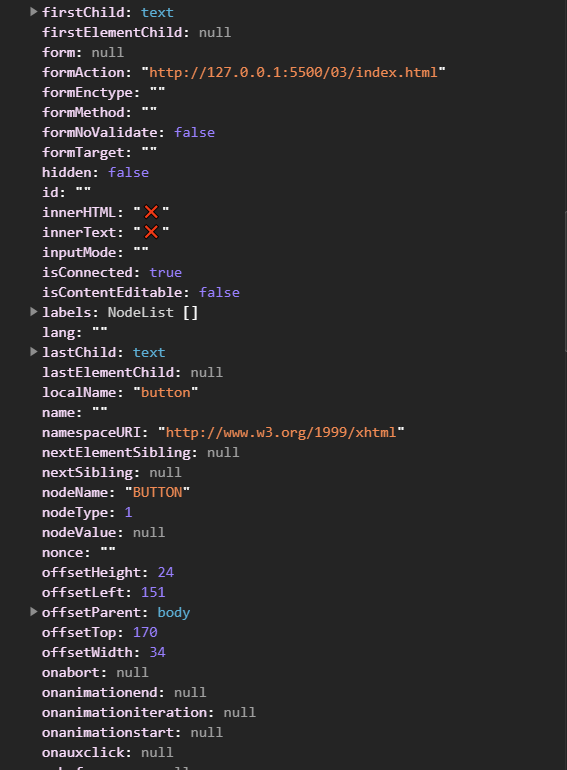
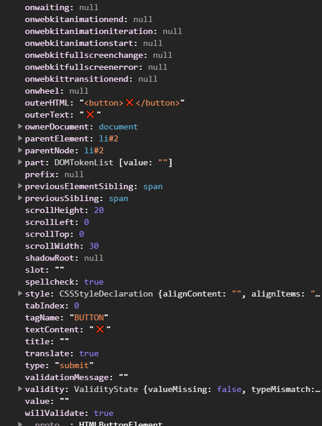
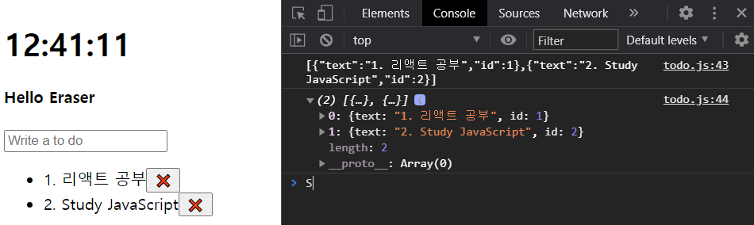
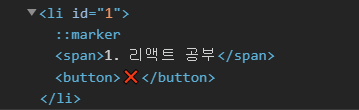
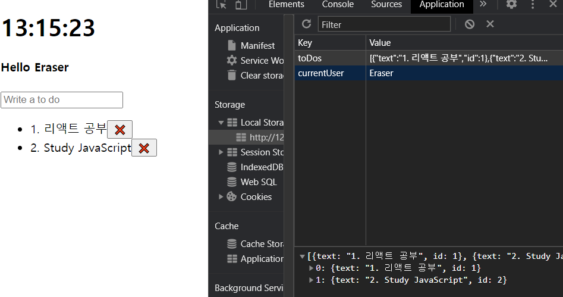
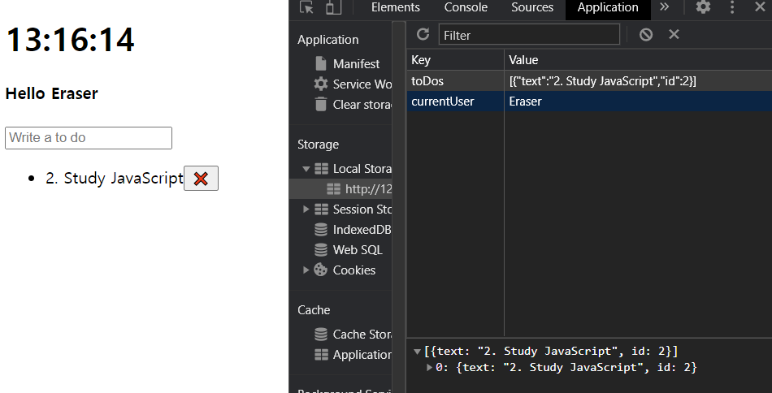
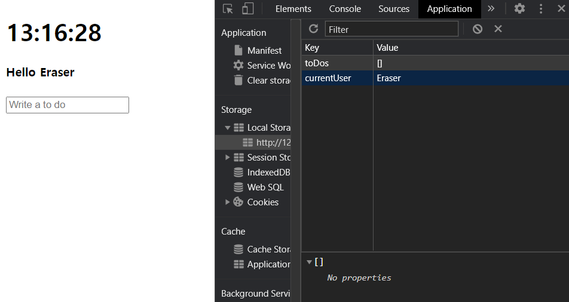

# array.forEach

 array에 담겨 있는 각각의 요소에 대해 함수를 실행한다.  실행할 함수는 외부에서 선언해 놓고 호출해도 되고, 안에서 바로 선언해도 된다.

<br>

# array.filter

 함수가 `true`를 return하도록 하는 필터 함수를 array의 모든 요소에 적용한다. 필터 함수를 적용했을 때 `true`가 되는 배열 요소들만을 남긴다.

 즉, array 내 모든 아이템에 대해 함수를 실행하고, `true`인 아이템만 가지고 새로운 array를 만들어 반환한다. (나중에 불변성 갈 때 필요한 부분이다!)

<br>

# event.target

 이벤트의 대상이 되는 target을 요소를 알려 준다. delete 기능을 구현할 때, `event.target`의 부모 요소를 찾기 위해 `console.dir`를 통해 찾아 갔던 부분을 잘 참고하자.


| 초기 화면                                                    | 찾는 중…                                                     | 계속 찾는 중…                                                |
| ------------------------------------------------------------ | ------------------------------------------------------------ | ------------------------------------------------------------ |
|  |  |  |

<br>

# Node.removechild

 노드의 자식 요소를 지울 수 있게 한다.

<br>


# ToDo 리스트


 To Do 리스트를 만든다.  greetings와 비슷하다. 그러나 hiding과 showing이 없다. 

<br>

## createElement

 이전까지의 query selector는 HTML document에서 필요한 것을 얻어 오는 형태였다. 그러나 이와 반대로, 생성하기를 원한다면, `.createElement` 메소드를 사용한다.

<br>

## index.html


1. todo form과 리스트를 만든 후, todo 스크립트를 연결한다.

```html
<!DOCTYPE html>
<html>
    
<head>
    <title>Something</title>
    <link rel='stylesheet' href='index.css' />
</head>

<body>
    <div class='js-clock'>
        <h1 class='js-title'></h1>
    </div>
    <form class='js-form form'>
        <input type='text' placeholder='What is your name?' />
    </form>
    <h4 class='js-greetings greetings'></h4>
    <form class='js-toDoForm'> <!-- todo form -->
        <input type='text' placeholder='Write a to do' />
    </form>
    <ul class='js-toDoList'></ul> <!-- todo 리스트 -->
    <script src='clock.js'></script>
    <script src='greeting.js'></script>
    <script src='todo.js'></script>
</body>

</html>
```

<br>

2. emoji가 안 보일 수 있으므로, `charset`을 'utf-8'로 설정해 준다.

```html
<!DOCTYPE html>
<html>
    
<head>
    <title>Something</title>
    <meta charset='utf-8' />
    <link rel='stylesheet' href='index.css' />
</head>

<body>
    <div class='js-clock'>
        <h1 class='js-title'></h1>
    </div>
    <form class='js-form form'>
        <input type='text' placeholder='What is your name?' />
    </form>
    <h4 class='js-greetings greetings'></h4>
    <form class='js-toDoForm'>
        <input type='text' placeholder='Write a to do' />
    </form>
    <ul class='js-toDoList'></ul>
    <script src='clock.js'></script>
    <script src='greeting.js'></script>
    <script src='todo.js'></script>
</body>

</html>
```


<br>

## todo.js

0. 그 전까지와 마찬가지로,  HTML document에서 불러와 사용할 변수들을 선언해 둔다. 
   * `form`, `input` 등의 변수 이름을 사용할 경우, `greetings.js` 등 다른 파일에서와 충돌할 우려가 있다. 좋지 않다.
   * 새로운 변수 명을 사용한다.

```javascript
const toDoForm = document.querySelector('.js-toDoForm'),
    toDoInput = toDoForm.querySelector('input'),
    toDoList = document.querySelector('.js-toDoList');

function init() {

}

init();
```

<br>


1. `toDo` 리스트를 보여 주는 `loadToDos` 함수를 설계한다.
   * 로컬 스토리지에서 load해올 것이므로 로컬 스토리지 `toDo` 속성을 이용해 아이템을 가져 오도록 변수를 설정한다. 
   * `loadToDos` 함수: 로드해올 것이 있을 때와 없을 때로 나누어 설계한다.
     * `toDos`가 있을 때: `toDoForm`은 항상 보여지는 것이므로, 일단은 크게 작업을 설계하지 않는다.
     * `toDos`가 없을 때:  무언가 작업을 한다.

```javascript
const toDoForm = document.querySelector('.js-toDoForm'),
    toDoInput = toDoForm.querySelector('input'),
    toDoList = document.querySelector('.js-toDoList');

const TODOS_LS = 'toDos'; // 로컬 스토리지의 toDo 속성 키.

function loadToDos() {
    const toDos = localStorage.getItem(TODOS_LS); // 로컬 스토리지에서 toDo 속성값을 가져 온다.
    if (toDos === null) {
        // toDo가 없는 경우.
    } else {
        // toDo가 있는 경우.
    }
}

function init() {
    loadToDos(); 
}

init();
```

<br>

2. `toDoForm`에 submit 이벤트가 발생했을 때 이벤트를 핸들링하는 과정을 설계한다.
   * default 동작을 해제한다.
   * submit 이벤트 발생했을 때의 현재 값을 가져 온다.
   * `paintToDo` 함수를 호출한다.
   * 이후 input form에 입력되어 있는 글자를 초기화한다.

```javascript
const toDoForm = document.querySelector('.js-toDoForm'),
    toDoInput = toDoForm.querySelector('input'),
    toDoList = document.querySelector('.js-toDoList');

const TODOS_LS = 'toDos';


function paintToDo(text) {
    // submit 이벤트 발생 시 호출될 함수.
    console.log(text); // 확인용.
}

function handleSubmit(event) {
    event.preventDefault(); // default 동작 설정 해제.
    const currentValue = toDoInput.value; // toDoForm 제출되었을 때의 값.
    paitnToDo(currentValue); // 현재 값을 paintToDo에 전달.
    toDoInput.value = ''; // submit 후 form의 input 삭제.
}

function loadToDos() {
    const toDos = localStorage.getItem(TODOS_LS);
    if (toDos !== null) {
    } 
}

function init() {
    loadToDos(); 
    toDoForm.addEventListener('submit', handleSubmit) // toDoForm의 submit 이벤트 핸들링.
}

init();
```

  이 단계까지 진행한 후, toDo가 제대로 저장되는지 확인하기 위해 form에 입력하고, submit한 후, console에 찍어 보자.


<br>

3. `paintToDo` 함수를 설계한다.

   * `toDo`로 보여 줄 리스트를 만든다.

     > 예컨대, 다음과 같은 형태로 설계되어야 한다.
     >
     > ```html
     >     <ul class='js-toDoList'>
     >         <li id='1'>blablabla</li> <!-- 예시 -->
     >     </ul>
     > ```
     >
     > * `li` 태그 이용.
     > * 숫자 타입의 id를 갖고, text를 갖도록 만들어야 한다.

     * 필요한 태그들을 생성한다.
       * `li`: toDo 리스트로 들어갈 리스트 태그.
       * `delBtn`: 삭제 버튼. (이모지: `window` + `.`)
       * `span`: text container로 사용할 태그. 버튼이 옆에 들어간다.
     * `li` 태그 아래에 `span`과 `delBtn`을 자식 요소로 추가한다. 즉, `li` 태그가 `span`과 `delBtn`의 컨테이너가 된다.
     * `toDoList`에 생성한 toDo 리스트들의 태그(`li`)를 자식 요소로 추가한다.


```javascript
const toDoForm = document.querySelector('.js-toDoForm'),
    toDoInput = toDoForm.querySelector('input'),
    toDoList = document.querySelector('.js-toDoList');

const TODOS_LS = 'toDos';

function saveToDos() {
    localStorage.setItem(TODOS_LS, JSON.stringify(toDos)); // toDos 목록을 가져와서 로컬 스토리지에 저장한다.
}

function paintToDo(text) {
    const li = document.createElement('li'); // li 생성.
    const delBtn = document.createElement('button'); // 삭제를 위한 delete button 생성.
    delBtn.innerText = '❌'; // 삭제 버튼에 이모지 삽입.
    const span = document.createElement('span'); // span 태그 생성.
    span.innerText = text; // submit 시 생성되어서 올 currentValue.
    li.appendChild(span); // li 아래에 span을 자식 요소로 넣는다.
    li.appendChild(delBtn); // li 아래에 delBtn을 자식 요소로 넣는다.
    toDoList.appendChild(li); // toDoList에 li를 자식 요소로 추가한다.
}

function handleSubmit(event) {
    event.preventDefault();
    const currentValue = toDoInput.value;
    paintToDo(currentValue); 
    toDoInput.value = ''; 
}

function loadToDos() {
    const toDos = localStorage.getItem(TODOS_LS);
    if (toDos !== null) {
    } 
}

function init() {
    loadToDos(); 
    toDoForm.addEventListener('submit', handleSubmit) 
}

init();
```

 잘 동작하는지 확인해 보자. 


<br>

 HTML 태그를 확인해 보면, 태그가 생성되어 있다!


<br>


4. `loadToDos()` 함수를 설계한다.

   * local Storage에서 `TODOS`를 가져 온다.

   * json.parse를 통해 javascript object로 파싱한다.

   * 불러온 `TODOS`를 화면에 보여주기 위해 `paintToDo`함수를 적용한다. 실행할 함수를 안에서 바로 선언한다.

     > *참고* : 파싱 유무의 차이.
     >
     >  파싱하지 않았을 때는 string 형태이다. 둘 차이를 확인하기 위해 콘솔에 출력해 보자.
     >
     > 

   * 


```javascript
const toDoForm = document.querySelector('.js-toDoForm'),
    toDoInput = toDoForm.querySelector('input'),
    toDoList = document.querySelector('.js-toDoList');

const TODOS_LS = 'toDos';

function saveToDos() {
    localStorage.setItem(TODOS_LS, JSON.stringify(toDos)); // toDos 목록을 가져와서 로컬 스토리지에 저장한다.
}

function paintToDo(text) {
    const li = document.createElement('li');
    const delBtn = document.createElement('button');
    delBtn.innerText = '❌';
    const span = document.createElement('span');
    span.innerText = text;
    li.appendChild(span);
    li.appendChild(delBtn);
    toDoList.appendChild(li);
}

function handleSubmit(event) {
    event.preventDefault();
    const currentValue = toDoInput.value;
    paintToDo(currentValue); 
    toDoInput.value = ''; 
}

function loadToDos() {
    const toDos = localStorage.getItem(TODOS_LS);
    if (toDos !== null) {
    } 
}


function loadToDos() {
    const loadedToDos = localStorage.getItem(TODOS_LS); // 로컬 스토리지에서 toDo 속성값을 가져 온다.
    if (loadedToDos !== null) {
        const parsedToDos = JSON.parse(loadedToDos); // string 형태로 load된 할 일 목록을 JSON 형태로 파싱한다.
        parsedToDos.forEach(function (toDo) {
            paintToDo(toDo.text); 
            // 각각의 toDo text에 대해 paintToDo 함수를 실행한다.
            // 위의 함수를 밖에 선언해도 무방하다.
        });
    }
}

function init() {
    loadToDos();
    toDoForm.addEventListener("submit", handleSubmit); 
}

init();
```

<br>

5. `deleteToDo` 함수를 설계한다.

   * HTML에서 버튼이 눌릴 때 `ToDo`를 삭제한다. 즉, `<li>` 파트를 지워야 한다.

     * 앞에서 만든 `paintToDo` 함수에서 `delBtn`에 이벤트 리스너를 추가해 준다.

     * 어떤 버튼이 눌렸는지 알아야 삭제할 수 있기 때문에, 클릭 이벤트의 target을 활용한다.

     * `event.target`의 부모 요소인 `<li>`를 전부 지우면 된다. `parentNode`이다.

       

   * 여기까지 설계하고 나면, 새로고침해도 다시 뜬다. local storage에서 지워지지 않았기 때문이다.

   * local storage에서 `ToDo` 하나를 삭제한 후, 저장한다.

     * `filter` 함수를 이용해, `li`에 없는 id를 가진 `ToDo`를 삭제한다.
       *  `toDo`의 id와 `li`의 id 자료형이 다르면 삭제되지 않으므로 주의!
       * `filter` 함수를 이용해 필터링되어 만들어진 새로운 array를 `cleanToDos`라고 한다.
     * local storage의 `toDos`를 `cleanToDos`로 교체한다.
       * 앞에서 `toDos`를 `const`로 선언했기 때문에, `let`으로 바꿔서 선언해 준다.
     * 교체 후 저장한다.

```javascript
const toDoForm = document.querySelector('.js-toDoForm'),
    toDoInput = toDoForm.querySelector('input'),
    toDoList = document.querySelector('.js-toDoList');

const TODOS_LS = 'toDos';

let toDos = []; // let 선언: 할 일 목록을 저장할 array.

function deleteToDo(event) {
    const btn = event.target; // 클릭 대상이 되는 버튼
    const li = btn.parentNode; // 버튼의 부모 요소인 li
    toDoList.removeChild(li); // li의 자식 요소를 지운다.
    const cleanToDos = toDos.filter(function (todo) {
        return todo.id !== parseInt(li.id);
        // li의 id와 todo의 id가 같지 않은 것을 반환한다.
        // li의 id가 문자형이므로 정수로 바꿔 준다
    });
    toDos = cleanTodos; // todo 교체
    saveToDos(); // 바뀐 todo 저장
}

function saveToDos() {
    localStorage.setItem(TODOS_LS, JSON.stringify(toDos)); // toDos 목록을 가져와서 로컬 스토리지에 저장한다.
}

function deleteToDo(event) {
    const btn = event.target; // 클릭 대상이 되는 버튼
    const li = btn.parentNode; // 버튼의 부모 요소인 li
    toDoList.removeChild(li); // li의 자식 요소를 지운다. 
}

function saveToDos() {
    localStorage.setItem(TODOS_LS, JSON.stringify(toDos));
}

function paintToDo(text) {
    const li = document.createElement('li');
    const delBtn = document.createElement('button');
    delBtn.innerText = '❌';
    delBtn.addEventListener("click", deleteToDo); // 삭제 버튼 클릭 시 deleteToDo 함수 실행.
    const span = document.createElement('span');
    span.innerText = text;
    li.appendChild(span);
    li.appendChild(delBtn);
    toDoList.appendChild(li);
}

function handleSubmit(event) {
    event.preventDefault();
    const currentValue = toDoInput.value;
    paintToDo(currentValue); 
    toDoInput.value = ''; 
}

function loadToDos() {
    const toDos = localStorage.getItem(TODOS_LS);
    if (toDos !== null) {
    } 
}

function loadToDos() {
    const loadedToDos = localStorage.getItem(TODOS_LS);
    if (loadedToDos !== null) {
        const parsedToDos = JSON.parse(loadedToDos); 
        parsedToDos.forEach(function (toDo) {
            paintToDo(toDo.text); 
        });
    }
}

function init() {
    loadToDos();
    toDoForm.addEventListener("submit", handleSubmit); 
}

init();
```

 실행해 보자. 

| 초기 상태                                                    | 삭제                                                         | 삭제                                                         |
| ------------------------------------------------------------ | ------------------------------------------------------------ | ------------------------------------------------------------ |
|  |  |  |


