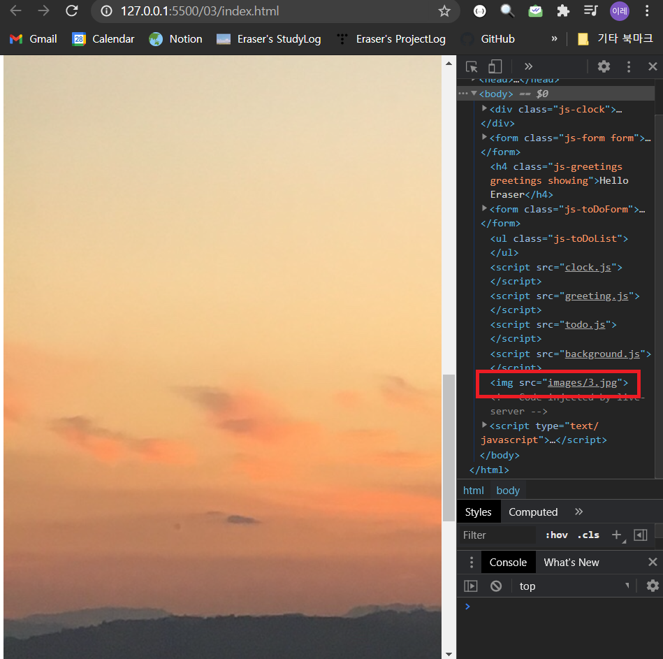
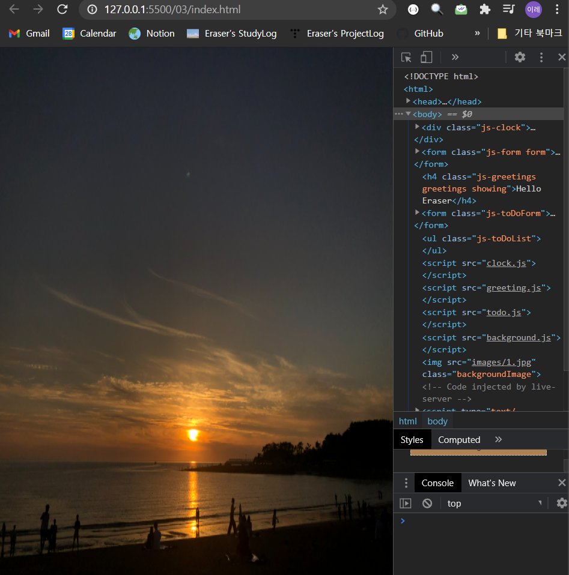
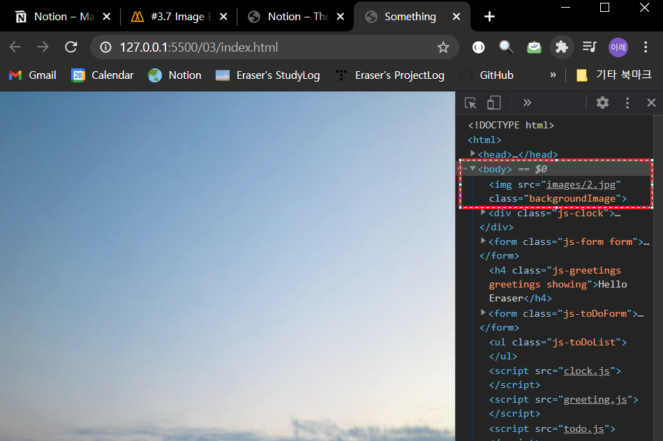
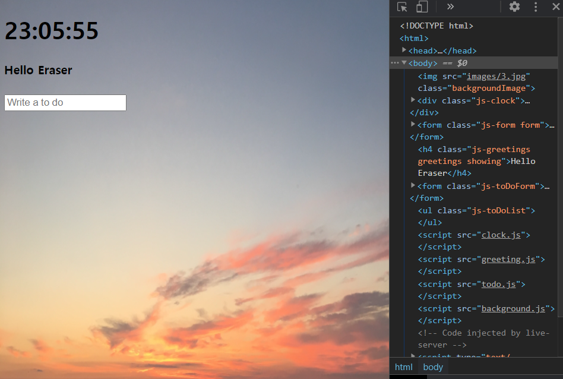

# Math 모듈

* `Math.random`: 무작위 숫자 생성.
* `Math.floor`: 버림.
* `Math.ceil`: 올림.

<br>

# Image Background


 배경 이미지에 사진 중 하나를 랜덤으로 넣는다. 이미지가 로딩될 때까지 기다렸다가, HTML 요소로 보여줄 것이다.

<br>

0. 사진을 다운로드하고 `images` 폴더에 넣는다. 이미지 이름을 숫자로 설정한다. 

<br>

1. `background.js` 파일을 만든다. 외부에서 배경 이미지를 가져올 수 있게 한다. 이후 `index.html`에 추가해 준다.

 ```html
<!DOCTYPE html>
<html>
    
<head>
    <title>Something</title>
    <meta charset='utf-8' />
    <link rel='stylesheet' href='index.css' />
</head>

<body>
    <div class='js-clock'>
        <h1 class='js-title'></h1>
    </div>
    <form class='js-form form'>
        <input type='text' placeholder='What is your name?' />
    </form>
    <h4 class='js-greetings greetings'></h4>
    <form class='js-toDoForm'>
        <input type='text' placeholder='Write a to do' />
    </form>
    <ul class='js-toDoList'></ul>
    <script src='clock.js'></script>
    <script src='greeting.js'></script>
    <script src='todo.js'></script>
    <script src='background.js'></script> <!-- 배경 추가 -->
</body>

</html>
 ```

<br>

2. ~~(언제나 그러하듯)~~ 틀을 잡고, `init` 함수를 만든다.
   * `body` 요소에 background 이미지를 설정할 것이므로, 변수로 선언한다.
   * `genRandom` 함수로 무작위 숫자를 생성하고, `init` 함수에서 무작위 숫자를 활용한다.

```javascript
const body = document.querySelector('body'); // body에 background를 설정한다.

const IMG_NUMBER = 3; // 이미지 개수

function genRandom() { // 랜덤 넘버 설정
    const number = Math.floor(Math.random() * IMG_NUMBER); // 이미지 개수 중 무작위 숫자
    return number;
}

function init() {
    const randomNumber = genRandom(); // 무작위 숫자
}

init()
```


<br>

3. `paintImage` 함수를 설계한다.
   * 인자로 이미지 번호를 받는다.
   * `image`에 `Image`라는 object를 생성한다.
   * `image`의 `src`를 설정한다. 랜덤 넘버가 0부터 생성되므로 1을 더해 준다.
   * `body`에 `image`라는 자식 요소를 추가한다. 
   * `body`의 자식 요소인 `image`에 클래스 속성을 추가해 준다.
   * `init`에서 호출된다.

```javascript
const body = document.querySelector("body");

const IMG_NUMBER = 3;

function paintImage(imgNumber) { 
    const image = new Image(); // 새로운 이미지
    image.src = `images/${imgNumber + 1}.jpg`; // 이미지 경로
    image.classList.add("backgroundImage"); // 클래스 속성 추가
    body.appendChild(image); // body에 자식 요소 추가
}

function genRandom() {
    const number = Math.floor(Math.random() * IMG_NUMBER); 
    return number;
}

function init() {
    const randomNumber = genRandom();
    
}

init();
```



<br>

4. ~~이미지 로드에 대한 이벤트 리스너를 추가한다.~~ : **API에서 다운로드할 때 사용하는 걸로!**

   * `loadend`에 대한 이벤트 리스너를 추가한다.

   * 이벤트 핸들러 함수 `handleImgLoad`를 설계한다.

     > *참고* : `loadend`
     >
     >  이벤트 핸들러 함수에 로딩이 끝났을 때 콘솔에 다음과 같이 출력하라고 코드를 작성한다. 
     >
     > ```javascript
     > function handleImgLoad() {
     >     console.log('finished loading');
     > }
     > 
     > function paintImage(imgNumber) {
     >     const image = new Image();
     >     image.src = `images/${imgNumber+1}.jpg`;
     >     body.appendChild(image); // 이미지 로드 체크용.
     >     image.addEventListner('loadend');
     > }
     > ```


<br>

5. `index.css`에서 이미지에 대한 클래스 속성을 CSS로 설정한다.

```css
.clicked {
    color: #7f8c8d;
}

.btn {
    cursor: pointer;
}

.form,
.greetings {
    display: none;
}

.showing {
    display: block;
}

.backgroundImage { 
    position: absolute;
    top: 0;
    left: 0;
    width: 100%;
    height: 100%;
    z-index: 0;
}
```

 실행해 보면 다음과 같다.



<br>

6. 배경이 뒤로 가게 한다. `5.` 단계까지는 `body` 요소에 `image` 요소를 자식 요소로 추가하는 것이 뒤에서 이루어졌다.

   * `appendChild`가 아니라, `prepend`를 사용한다.

     

   * `z-index`를 `-1`로 설정한다.

     

<br>

7. 조금 더 예쁘게 CSS 설정을 바꿔 보자.

```css
.clicked {
    color: #7f8c8d;
}

body {
    background-color: #ecf0f1;
}

.btn {
    cursor: pointer;
}

.form,
.greetings {
    display: none;
}

.showing {
    display: block;
}

@keyframes fadeIn {
    from {
        opacity: 0;
    }
    to {
        opacity: 1;
    }
}

.backgroundImage {
    position: absolute;
    top: 0;
    left: 0;
    width: 100%;
    height: 100%;
    z-index: -1;
    animation: fadeIn 0.5s linear;
}
```

